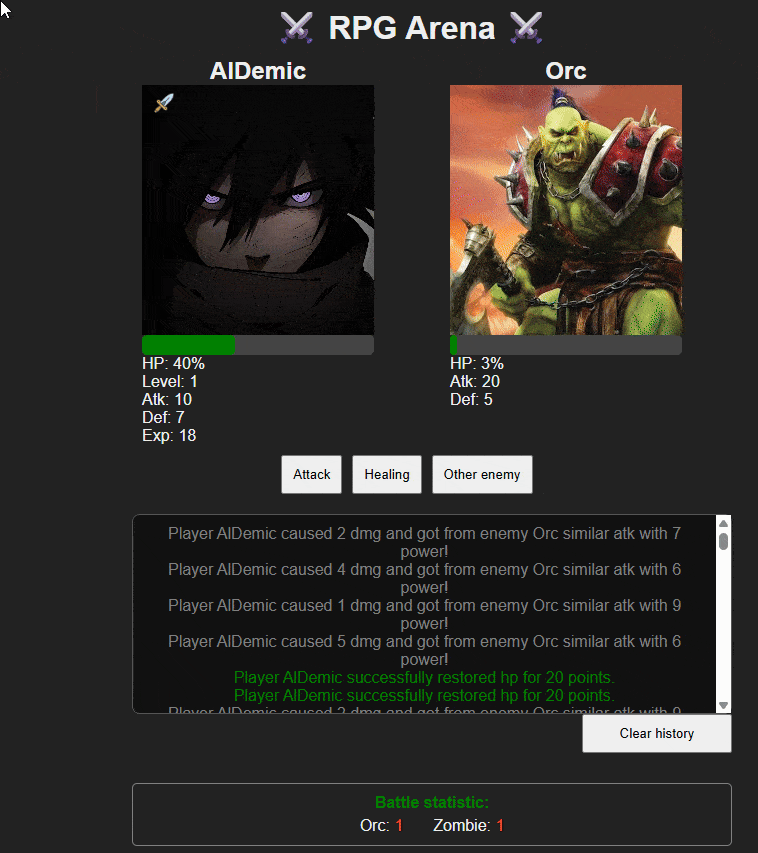

# RPG Arena ⚔️

## Description
Turn-based battle game with random enemies, level-ups, and dynamic combat influenced by real-time weather and time of day.

## 🎮 Gameplay

Fight random enemies; earn experience and level up.

Player and certain enemies (like Vampires) deal damage based on time of day and weather conditions.

Battle log tracks damage, healing, level-ups, and deaths.

Visual effects include:

- attack animations;

- health bar;

- healing effect;

- level-up effect;

- death effect (gray avatar, crossed name, death icon);

- buffs with tooltips.

## ⚙️ Technologies

* JavaScript (ES6 modules) – game logic & async API calls

* HTML5 & CSS3 – UI structure and styling

* LocalStorage – saving player progress and battle stats

* Open-Meteo API – weather-based gameplay adjustments

* tippy.js – interactive tooltips for buffs

* DOM Manipulation & Animation – dynamic character rendering & effects

## 📸 Demonstration

## 📸 Screenshots
- Additional screenshots can find in folder: /screenshots/

## ⚙️ Running the Game(!)

1. Use a local server (for ES modules and API fetch requests):

- with VS Code, install Live Server: extension → right-click index.html → Open with Live Server.

- or using Node.js: npx serve

2. Open your browser at the provided URL.

3. Start playing!

- ⚠️ Opening index.html directly in a browser without a server may break modules and API calls.
